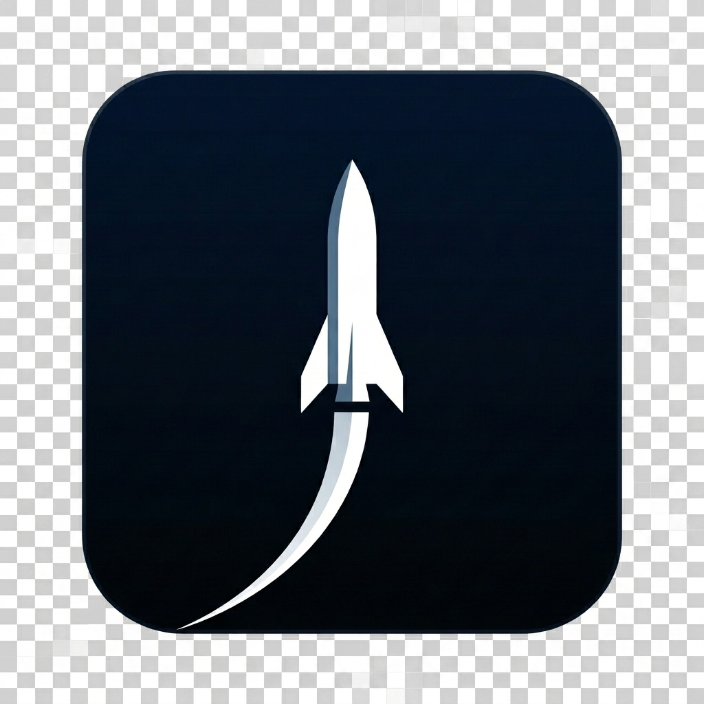

# SpaceX 发射日历 (SpaceX Launch Calendar)

<p align="center">
  
</p>

一个基于 **Nuxt 4** + **Nuxt Hub** + **Cloudflare Pages** 构建的现代化全栈 Web 应用。它能够将 SpaceX 官网的实时发射数据流转换为符合 RFC 5545 标准的 **ICS 订阅日历**，完美适配 Apple Calendar、iCloud、Google Calendar、Outlook 等日历客户端，同时提供了一个支持深色模式、多语言（i18n）以及超高清图解预览的高颜值交互式落地页。

---

## 🌟 功能特性

- **📅 多渠道日历订阅**：
  - `/spacex.ics` / `/calendar.ics` 导出标准的 RFC-compliant ICS 日历数据。
  - 支持 `webcal://` 协议，可在 Apple Calendar 等设备中实现一键订阅与自动同步。
- **⚡️ 边缘架构与高性能缓存**：
  - 基于 **Nuxt Hub KV** (Cloudflare KV) 缓存上游 SpaceX 双数据源。
  - 采用 **SWR (Stale-While-Revalidate)** 异步后台刷新技术，前端响应时间降至毫秒级，同时杜绝频繁请求导致上游封禁的风险。
  - 内置基于 UUID 和哈希的版本追踪，确保 `SEQUENCE` 与 `LAST-MODIFIED` 在发射窗口微调时精准更新，避免日历客户端重复提示。
- **🎨 现代极致视觉体验**：
  - 使用 **Nuxt UI** (Tailwind CSS) 构建的极简、未来感交互界面，完美融合 SpaceX 品牌美学。
  - 原生支持系统级 **深色模式 (Dark Mode)** 切换，流转顺滑。
  - 内置实时高精度 **发射倒计时** 计时器。
  - **交互式日历组件**：包含一个迷你日历网格、今日聚焦、事件时间轴，以及可直接交互的发射任务详情卡片。
  - **高清互动图解**：支持在详情页中一键打开超高清任务发射图解（Infographic），配备带磨砂玻璃背景的 Lightbox 弹窗和双击/点击缩放查看原图功能。
- **🌐 全球多语言支持 (i18n)**：
  - 原生集成 `@nuxtjs/i18n`，首屏自动检测浏览器语言并加载对应语言包，无前缀干净路由。
  - 完整支持 7 种语言：**简体中文、English、日本語、한국어、Español、Français、Deutsch**。
  - 配备基于 LLM JSON Schema 的自动化翻译更新脚本，保障新增文案能够秒级扩展至所有语言。
- **📈 极致的 SEO & 结构化数据**：
  - 适配 Nuxt 4 标准的响应式 SEO Meta 元数据声明，包含完整的 Open Graph (OG) 与 Twitter Card 预览卡片支持。
  - 自动向页面头部注入 **JSON-LD 谷歌结构化事件数据 (Event Schema)**，便于 Google 等搜索引擎直接提取并展示即将到来的发射日程。
- **🔄 双源实时合并**：
  - 自动聚合 SpaceX 官方 upcoming API 模块的板块卡片信息与高精度的 timings 倒计时数据。
  - 优雅降级机制：即使 Timing API 临时故障，仍能依据磁贴基础数据生成日历。

---

## 🛠️ 技术栈

- **框架核心**：Nuxt 4 (`nuxt`)
- **开发与部署套件**：Nuxt Hub (`@nuxthub/core`) + Cloudflare Pages / Workers
- **UI 框架与样式**：Nuxt UI (`@nuxt/ui`) & Tailwind CSS & Heroicons
- **国际化引擎**：Nuxt i18n (`@nuxtjs/i18n`)
- **测试框架**：Node.js 原生测试运行器 (`node --test`)
- **运行环境**：Wrangler (`wrangler`)

---

## 📁 项目结构

```text
├── app/                     # Nuxt 4 前端应用层
│   ├── app.vue              # 应用主入口
│   ├── assets/              # 全局静态资源及自定义 CSS 样式（渐变、动画）
│   ├── components/          # 封装的 UI 组件库
│   ├── composables/         # 响应式状态与 hooks
│   └── pages/               # 路由页面（主页入口 index.vue）
├── server/                  # Nuxt 4 服务端 (Nitro Engine)
│   ├── api/                 # 结构化 JSON 接口
│   │   ├── launches.get.js          # 获取即将发射的列表
│   │   ├── history-launches.get.js  # 获取历史已发射列表（限制50条）
│   │   └── launches/
│   │       └── [slug].get.js        # 获取某特定发射任务的深度图文详情
│   ├── routes/              # ICS 标准订阅路由
│   │   ├── spacex.ics.js            # 主日历源
│   │   └── calendar.ics.js          # 别名日历源
│   └── utils/               # 后端工具库
│       ├── kv.js                    # 缓存及 SWR 核心控制逻辑
│       └── spacex.js                # 数据拉取、格式标准化与 ICS 组装
├── i18n/                    # 国际化翻译资源包
│   └── locales/             # 7国语言的 .json 字典及支持配置
├── public/                  # 网站纯静态资源（字体、网站图标、robots、sitemap）
├── scripts/                 # 自动化运维脚本
│   └── translate-locales.js # 基于大模型的自动多语言翻译脚本
├── wrangler.toml            # Cloudflare & KV 空间配置文件
└── nuxt.config.js           # Nuxt 全局配置文件
```

---

## 🚀 本地开发与调试

### 1. 克隆并安装依赖
```bash
npm install
```

### 2. 初始化 Nuxt Hub 及 Cloudflare KV（必须）
运行以下命令创建你的本地或线上 Cloudflare KV 命名空间，并将输出的 `id` 填写至 `wrangler.toml` 文件中：
```bash
# 创建生产环境的 KV 空间
npx wrangler kv namespace create SPACEX_KV

# 创建开发/预览环境的 KV 空间
npx wrangler kv namespace create SPACEX_KV --preview
```

### 3. 启动开发服务器
```bash
npm run dev
```
开发服务器将默认运行在：`http://localhost:3000`。
你可以在本地调试以下端点：
- 落地网页：`http://localhost:3000/`
- 日历订阅源：`http://localhost:3000/spacex.ics`
- 发射数据接口：`http://localhost:3000/api/launches`
- 某任务细节接口：`http://localhost:3000/api/launches/starlink-group-10-1`

---

## 🧪 自动化测试

项目内置了 17 项全覆盖的单元测试，包含对 SpaceX API 响应降级、ICS 文本安全转义、SWR 缓存机制、以及时区转换的全面校验。

运行命令：
```bash
npm test
```

---

## 🌍 多语言翻译更新指南

若你在 `i18n/locales/en.json` 中添加或修改了前端界面的词条，无需手动翻修其余 6 种语言。可使用内置大语言模型翻译助手完成一键同步：

1. 配置环境变量：
   ```bash
   export OPENAI_API_KEY="your-openai-api-key"
   ```
2. 运行同步脚本（以翻译更新德语、日语、西班牙语为例）：
   ```bash
   npm run translate:locales -- --locales=de,ja,es
   ```

---

## ☁️ 部署上线

本项目极其适合部署在 **Cloudflare Pages**。

### 方式 A：通过 Nuxt Hub 平台（推荐）
在 Nuxt Hub 控制台关联你的 GitHub 仓库，它会自动为你检测并开通 KV 存储空间、编译并进行边缘部署。

### 方式 B：手动通过 Wrangler 部署
```bash
npm run build
npx wrangler deploy
```

部署完成后，在 Cloudflare 后台为你的项目绑定自定义域名（例如 `spacex-calendar.mou7s.com`）。

### 部署后验证
你可以使用 `curl` 验证日历源响应头是否正确：
```bash
curl -I https://spacex-calendar.mou7s.com/spacex.ics
```
**预期响应**：
```text
HTTP/2 200
content-type: text/calendar; charset=utf-8
cache-control: public, max-age=300
content-disposition: inline; filename="spacex-launches.ics"
```

---

## 📝 备注与免责

- 本项目的数据源均拉取自 SpaceX 官网暴露的真实前端 API，不受 SpaceX v4 历史 API 停止维护的影响。
- 本项目日历数据只专注于即将到来的/计划中的航天发射任务（Upcoming Launches），详情卡片支持查询最近 50 次已完成发射（History Launches）的元数据。
- 日历事件时间依据浏览器时区或日历客户端设定自动换算，无需手动调整。
